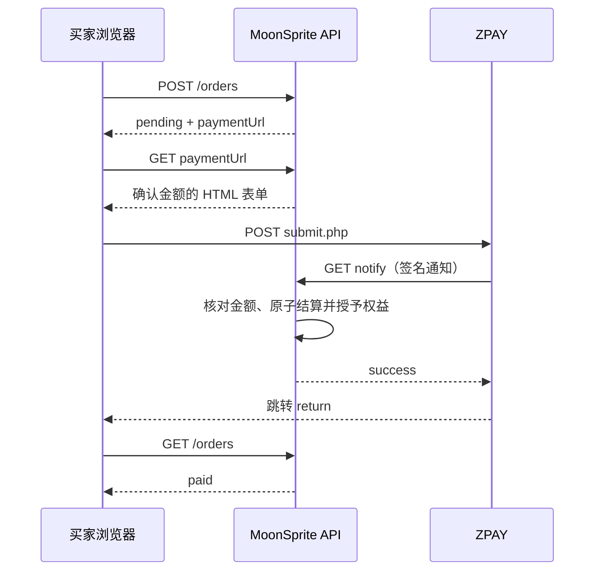

# MoonSprite 后端接口文档

版本：当前实现 · 更新日期：2026-09-30

本文面向前端、客户端和联调开发者，依据 `server/app.mjs`、`server/auth.mjs`、`server/validation.mjs`、`server/payments.mjs` 编写。描述已实现行为；部署、商户配置和管理员初始化见 [后端运行说明](backend-setup.md)。

## 1. 基础约定

### 1.1 地址与数据格式

| 项目 | 约定 |
| --- | --- |
| API 前缀 | `/api`，没有 `/v1` 前缀 |
| 本地网站 | `http://localhost:5173`；`pnpm dev` 已配置同源代理 |
| 本地 API 直连 | 默认 `http://127.0.0.1:3001/api` |
| 正式环境 | `https://你的域名/api`，网站与 API 同源 |
| 普通请求 | `Content-Type: application/json`；根值必须是对象 |
| 文件上传 | `multipart/form-data`，文件字段名 `file` |
| 默认成功响应 | 直接返回对象或数组，没有外层 `data` / `ok` 包装 |
| 无返回值 | HTTP `204`，不要调用 `response.json()` |
| 时间 | Unix 毫秒时间戳，例如 `1790726400000` |
| ID | 字符串；订单号即使全为数字，也按字符串处理 |
| 金额 | 商品、订单、账本和提现使用 USD 数值；`paymentCny` 使用 CNY 数值 |
| 换算 | 当前固定 `1 USD = 7.2 CNY`，订单保存下单时的换算和实收金额 |
| 列表 | 当前没有分页、搜索或排序参数；客户端不要假设这些参数生效 |

服务器以整数分计算金额，再按接口约定返回主货币单位。商品金额最多两位小数；不能向请求传入 `"10.00"` 这样的字符串代替数值 `10`。请求中的大部分普通文本会去除首尾空格，密码不会。

普通请求体最大 4 MiB；商品可编辑数据另有 JSON 字符长度上限。文件上传限制见第 6 节。接口响应默认 `Cache-Control: no-store`。

### 1.2 Cookie 认证与 CSRF

注册和登录成功会设置以下 Cookie：

```http
Set-Cookie: moonsprite_session=<随机会话值>; Path=/; HttpOnly; SameSite=Lax; Max-Age=604800
```

HTTPS 配置下追加 `Secure`。会话有效期为 7 天，不使用 Bearer Token。浏览器请求需要 `credentials: 'include'`。

普通前端请求统一携带 `X-MoonSprite-Client: web`。服务器检查：

- 存在 `Origin` 时，必须与服务端 `PUBLIC_ORIGIN` 完全一致。
- 非 GET/HEAD 请求不得携带 `Sec-Fetch-Site: cross-site`。
- 非 GET/HEAD 请求需要合法 Origin，或者 `X-MoonSprite-Client: web`。

该自定义请求头不是凭证；写操作仍检查 Cookie、角色和资源归属。API 不开放跨域凭据请求。CLI/Postman 调用可携带自定义请求头并保存 Cookie；不要伪造不匹配的 Origin。

### 1.3 权限符号

| 本文标记 | 含义 |
| --- | --- |
| 公开 | 无需登录；仍受通用 Origin 与限流规则约束 |
| 登录 | 任意有效账户 |
| 创作者 | `creator` 或 `admin` |
| 管理员 | `admin` |
| 文件管理者 | 商品所有者或管理员 |
| 文件读者 | 已购/已领取该商品的账户，或文件管理者 |

注册只获得 `buyer`，请求中传入 `roles` 不会提升权限。角色由服务器管理命令授予。当前购买和发布接口不强制 `emailVerified=true`，不能把邮箱验证状态当作已经存在的业务门槛。

### 1.4 统一错误

```json
{
  "error": {
    "code": "forbidden"
  }
}
```

没有保证返回 `message` 字段。客户端应按 `error.code` 展示文案。HTTP 路由不存在通常返回 `404 missing`；当前未统一使用 405 表示方法不支持。

`src/api/transport.ts` 的 `network`、`timeout`、`invalid-response` 是客户端产生的错误，不是后端业务响应。普通 JSON 客户端不能直接用于收银台 HTML、邮件确认 HTML 或文件字节端点。

## 2. 接口总览

以下路径均相对于 `/api`。`:id`、`:productId` 需要替换为实际 ID。

| 方法 | 路径 | 权限 | 成功响应 |
| --- | --- | --- | --- |
| GET | `/health` | 公开 | 200 `{ "ok": true }` |
| GET | `/auth/session` | 公开 | 200 Account 或 null |
| POST | `/auth/register` | 公开 | 201 Account + Cookie |
| POST | `/auth/sign-in` | 公开 | 200 Account + Cookie |
| POST | `/auth/sign-out` | 公开 | 204，清除当前 Cookie |
| PATCH | `/auth/profile` | 登录 | 200 Account |
| POST | `/auth/password` | 登录 | 204 + 新 Cookie |
| POST | `/auth/password/reset` | 公开 | 申请：204；提交令牌：200 HTML |
| GET | `/auth/password/reset?token=...` | 有效令牌 | 200 HTML |
| POST | `/auth/email/verify` | 申请需登录；确认需令牌 | 申请：200 Account；确认：200 HTML |
| GET | `/auth/email/verify?token=...` | 有效令牌 | 200 HTML |
| DELETE | `/auth/account` | 登录 | 204 |
| GET | `/catalogue` | 公开 | 200 StudioProduct[] |
| GET | `/studio/products` | 创作者 | 200 StudioProduct[] |
| POST | `/studio/products` | 创作者 | 201 StudioProduct |
| PATCH | `/studio/products/:id` | 创作者且拥有商品，或管理员 | 200 StudioProduct |
| DELETE | `/studio/products/:id` | 创作者且拥有商品，或管理员 | 204 |
| PATCH | `/admin/listings/:id` | 管理员 | 204 |
| GET | `/files` | 公开，结果按身份过滤 | 200 string[] |
| PUT | `/files/:productId` | 文件管理者 | 200 FileMetadata |
| GET | `/files/:productId` | 文件读者 | 200 FileMetadata + url |
| DELETE | `/files/:productId` | 文件管理者 | 204 |
| GET | `/files/:productId/content` | 文件读者；草稿仅管理者 | 200 二进制附件 |
| POST | `/downloads/:productId` | 文件读者 | 200 `{ "url": "..." }` |
| GET | `/orders` | 匿名返回空数组 | 200 Order[] |
| POST | `/orders` | 登录 | 201 Order |
| POST | `/orders/:id/reconcile` | 订单买家或管理员 | 200 Order |
| GET | `/payments/:id/checkout` | 订单买家 | 200 HTML |
| GET | `/payments/zpay/notify` | ZPAY 签名校验 | 200 文本 success |
| GET | `/payments/zpay/return` | 公开 | 303 跳转 |
| GET | `/studio/orders` | 创作者 | 200 授权范围内已付款 Order[] |
| GET | `/studio/ledger` | 创作者 | 200 Ledger |
| GET | `/studio/settings` | 公开 | 200 `{ "percent": 8 }` |
| PATCH | `/studio/settings` | 管理员 | 204 |
| POST | `/studio/withdrawals` | 创作者 | 201 Withdrawal |
| GET | `/admin/withdrawals` | 管理员 | 200 Withdrawal[] |
| PATCH | `/admin/withdrawals/:id` | 管理员 | 204 |
| GET | `/community` | 公开，结果按身份过滤 | 200 CommunitySnapshot |
| POST | `/support/tickets` | 登录 | 204 |
| PATCH | `/admin/tickets/:id` | 管理员 | 204 |
| POST | `/reports` | 登录 | 204 |
| PATCH | `/admin/reports/:id` | 管理员 | 204 |

## 3. 账户与安全

### 3.1 Account 数据结构

```json
{
  "id": "usr_11111111-1111-4111-8111-111111111111",
  "name": "小月",
  "email": "buyer@example.com",
  "roles": ["buyer"],
  "createdAt": 1790726400000,
  "emailVerified": false
}
```

邮箱会转换为小写。响应不包含密码、密码摘要、会话值或邮件令牌。

### 3.2 注册、登录、会话、退出

`POST /auth/register`：

```json
{ "name": "小月", "email": "buyer@example.com", "password": "example-password-123" }
```

`name` 为 1–40 字符，邮箱为有效格式且长度 3–254，密码为 8–128 字符。成功返回 201 Account 并直接登录。已注册邮箱返回 `409 exists`。

`POST /auth/sign-in`：

```json
{ "email": "buyer@example.com", "password": "example-password-123" }
```

成功返回 200 Account 并设置新会话。凭据错误返回 `401 credentials`；格式不合法可能先返回 `400 email/password`。

`GET /auth/session` 无请求体。有效会话返回 Account，否则返回 JSON `null`，不是 401。

`POST /auth/sign-out` 无请求体，删除当前会话并清除 Cookie。未登录调用同样返回 204，不会注销其他设备的会话。

### 3.3 修改资料和密码

`PATCH /auth/profile` 可提交 `name`、`email` 中一项或两项：

```json
{ "name": "月光画师", "email": "new@example.com" }
```

成功返回更新后的 Account。邮箱占用返回 `409 taken`。更换邮箱会置 `emailVerified=false`，使该账户旧邮件令牌失效；此接口不会自动发送验证邮件。它不接受角色变更，也不要求提交当前密码。

`POST /auth/password`：

```json
{ "current": "example-password-123", "next": "new-example-password-456" }
```

两个密码均需满足 8–128 字符限制。当前密码错误为 `400 current`，新旧相同为 `400 same`。成功返回 204，撤销所有原会话及邮件令牌，并为当前请求建立新会话。并发密码变更可能返回 `409 conflict`。

### 3.4 找回密码

申请：`POST /auth/password/reset`

```json
{ "email": "buyer@example.com" }
```

合法邮箱请求统一返回 204，无论邮箱是否存在。为避免泄露账户存在性，邮箱不存在、投递失败或账户邮件发送配额耗尽不会通过此申请响应区分；通用 IP 限流仍可能返回 429。因此 204 不等于邮件一定已投递。

邮件链接：`GET /auth/password/reset?token=<64位十六进制令牌>` 返回 HTML 表单，仅打开链接不会修改密码。

完成重置：`POST /auth/password/reset`

```json
{ "token": "<邮件中的令牌>", "password": "new-example-password-456" }
```

此请求也支持 `application/x-www-form-urlencoded`，用于原生 HTML 表单。成功返回 **200 HTML**，消费令牌并撤销所有会话；用户需重新登录。令牌不正确、过期或重复消费返回 `400 token`。

### 3.5 验证邮箱

申请：已登录用户 `POST /auth/email/verify`，无请求体。未验证时发送邮件，返回 200 Account；仅发送邮件不会把 `emailVerified` 改为 true。已验证用户直接返回 Account。

确认页：`GET /auth/email/verify?token=<令牌>`，返回 200 HTML。

完成验证：`POST /auth/email/verify`

```json
{ "token": "<邮件中的令牌>" }
```

确认时只要求令牌有效，无需登录；可使用 JSON 或表单编码。成功返回 **200 HTML**，将邮箱标记为已验证。投递失败为 `503 mail-unavailable`；邮件配额耗尽为 `429 rate-limited`。

验证和重置令牌有效期均为 1 小时、只可使用一次。重新申请同类型令牌会使该账户同类型旧令牌失效。

### 3.6 注销账户

`DELETE /auth/account` 无请求体。成功返回 204 并退出登录。删除登录资料、会话、令牌、购买权益和个人工单/举报，归档该账户商品；保留财务记录用于对账。

存在可用收入或 requested/approved 提现时返回 `409 unsettled-balance`；存在待付款订单时返回 `409 pending-order`。当前没有通过该接口强制清除这些状态的参数。前端的 DELETE 确认文本是界面确认，不是此接口必填字段。

## 4. 商品目录与创作者发布

### 4.1 PublishInput

新建和编辑使用相同请求体：

```json
{
  "name": { "zh": "月猫宠物", "en": "Mooncat" },
  "tagline": { "zh": "陪伴创作的像素宠物", "en": "A pixel companion" },
  "body": { "zh": "包含待机和行走动画。", "en": "Includes idle and walk animations." },
  "price": 1.25,
  "category": "pets",
  "size": "1 pet · 8 animations",
  "formats": ["mspet"],
  "tags": ["pixel"],
  "image": "/assets/market/mooncat/frames/0.png",
  "previews": [],
  "includes": [{ "zh": "宠物文件", "en": "Pet package" }],
  "packs": [],
  "compatibleVersion": "1.0"
}
```

示例图片路径需替换为实际存在的资源。参数校验如下：

| 字段 | 必填 | 约束 |
| --- | --- | --- |
| name | 是 | `{zh,en}`，两种语言各 1–120 字符 |
| tagline | 是 | `{zh,en}`，各 0–300 字符 |
| body | 是 | `{zh,en}`，各 0–20000 字符 |
| price | 是 | 数值，0–100000 USD，最多两位小数 |
| category | 是 | pets / assets / bundles / extensions / scripts |
| size | 是 | 字符串，0–120 字符 |
| formats | 是 | 最多 20 项，每项 1–40 字符；允许空数组 |
| tags | 否 | 默认 []，最多 30 项，每项 1–60 字符 |
| image | 否 | 预览图地址，规则见下文 |
| previews | 否 | 默认 []，最多 6 个预览图地址 |
| includes | 否 | 默认 []，最多 30 个 `{zh,en}`，每种语言最多 160 字符 |
| packs | 否 | 合集成员，最多 50 个 ID，每个 1–100 字符；非 bundles 类别强制为空数组 |
| compatibleVersion | 否 | 非空时 1–80 字符 |
| animations | 否 | 仅 pets 类别处理，见 4.2 |

预览图地址允许受限 `/assets/...` 路径、HTTPS URL，或 PNG/JPEG/WebP/GIF 的 base64 data URL；每个字符串不超过 710000 字符。归一化后商品 JSON 长度不超过 3000000 个字符。前端图片选择器还可能有更严格限制；后端当前不下载远程图片、不校验其实际像素或内容。

`id`、`sellerId`、`publishedAt`、`updatedAt`、`archived`、`soldCount`、`cartCount`、`download` 等服务端字段不能通过此请求指定。其他未知字段不作为可编辑数据保存。

合集成员必须存在、未归档且不是其他合集；普通创作者只能引用自己的商品，管理员可跨商品所有者操作。购买合集当前只获得合集自身的权益与交付包，不自动获得成员的独立下载权益。

### 4.2 动画数据

```json
{
  "order": ["idle"],
  "sheets": {
    "idle": {
      "dir": "idle",
      "sources": ["https://example.com/frame-0.png"],
      "frames": 1,
      "frameWidth": 64,
      "frameHeight": 64,
      "duration": 1000
    }
  },
  "labels": { "idle": { "zh": "待机", "en": "Idle" } },
  "idle": { "dir": "idle" }
}
```

`order` 必须有 1–40 个不重复 ID，每个 ID 长度 1–100；每个 ID 都需有对应 sheets 和 labels。标签各语言 1–60 字符。动画帧配置要求：`dir` 长度 1–160；`frames` 为 1–64 整数；`sources` 数量等于 frames，图片地址遵守上一节规则；宽高为 1–4096 整数；duration 为 100–60000 毫秒整数。

`idle.dir` 需匹配某个 sheet，服务端会将完整 sheet 写入响应的 idle。当前发布校验不会保留 `triggers` 等额外动画字段。CLI 导入的可信历史商品可能采用不同的预览引用结构，不应直接作为新发布请求照搬。

### 4.3 新建、编辑、归档与查询

- `POST /studio/products`：提交 PublishInput，201 返回 StudioProduct；创建后状态为 pending，尚未上架。
- `PATCH /studio/products/:id`：提交**完整 PublishInput**，200 返回更新商品。它不是部分字段补丁；缺失必填字段会失败，省略可选数组会变为 []。保留 ID 和首次发布时间，更新 updatedAt，清除 archived 并重新进入 pending。
- `DELETE /studio/products/:id`：204，只设置 archived=true，不删除已购权益和交付文件。
- `GET /studio/products`：创作者取得自己全部商品（含归档），管理员取得全站商品。
- `GET /catalogue`：只返回未归档、审核 approved 且有正式交付文件的商品；未登录可访问。

StudioProduct 是 PublishInput 的规范化结果加上以下字段：

```json
{
  "id": "pack_22222222-2222-4222-8222-222222222222",
  "sellerId": "usr_11111111-1111-4111-8111-111111111111",
  "publishedAt": 1790726400000,
  "updatedAt": 1790726400000,
  "archived": false
}
```

上述片段只展示附加字段，不是完整响应。审核状态通过 `/community` 返回，不在商品本体中。`soldCount`、`cartCount` 是前端兼容类型中的可选字段，当前发布服务不计算或保证返回；缺失不能解释为零。

### 4.4 商品审核

`PATCH /admin/listings/:id`：

```json
{ "status": "rejected", "reason": "交付包缺少说明文件" }
```

status 可选 pending / approved / rejected。rejected 时 reason 必填且 1–1000 字符，其余状态可省略。approved 要求存在正式文件或待审文件，否则 `409 missing-file`。成功返回 204。

通过审核时，将待审文件原子替换为正式文件。修改商品或重新上传文件会再次进入 pending；已购用户在新文件通过审核前仍下载旧正式文件。归档商品不会因单独审核 approved 而自动解除归档。

## 5. 订单与 ZPAY 支付

### 5.1 创建订单

`POST /orders`：

```json
{
  "lines": [{ "id": "pack_22222222-2222-4222-8222-222222222222", "quantity": 1 }],
  "paymentType": "alipay"
}
```

lines 为 1–50 项，不允许重复商品 ID；quantity 为 1–99 整数。paymentType 为 alipay / wxpay，默认 alipay。价格、名称、卖家和费率均由服务端读取，即使请求额外携带这些字段也不会采用。

收费订单成功响应：HTTP 201

```json
{
  "id": "1790726400000123456789",
  "createdAt": 1790726400000,
  "total": 1.25,
  "lines": [{
    "id": "pack_22222222-2222-4222-8222-222222222222",
    "name": "月猫宠物",
    "price": 1.25,
    "quantity": 1,
    "platformFeePercent": 8
  }],
  "status": "pending",
  "paymentCny": 9,
  "paymentUrl": "/api/payments/1790726400000123456789/checkout"
}
```

Order 的 total/line.price 是 USD，paymentCny 是 CNY；line.name 当前保存商品中文名。响应不包含内部 accountId、sellerId、费用分值或平台流水。paid 订单不返回 paymentUrl。

下单规则：

- 商品必须未归档、已审核、有正式交付文件；不能购买自己的商品，也不能重复购买已拥有的商品。
- 免费订单立即返回 paid，发放下载权益；收费订单返回 pending，仅此时还没有下载权益或卖家收入。
- 未配置 ZPAY 时，收费订单返回 `503 payment-unavailable`，不会保存成功订单；免费领取可用。
- 当前账号的相同商品集合、数量和支付方式已有 pending 订单时，返回原订单和原报价，仍为 201。商品 ID 输入顺序不影响匹配。
- 与其他 pending 订单存在重叠商品而不满足上述匹配条件时，返回 `409 pending-order`。
- 幂等匹配前仍会检查当前商品资格；已下架商品可能使重试创建失败，但现有订单仍可通过历史记录继续查看。

没有 `Idempotency-Key` 请求头约定，也没有自动过期待付款订单或取消订单端点。

### 5.2 查询订单

`GET /orders`：返回当前买家的全部 Order[]，包括 pending 和 paid；匿名返回 []。没有单独的 GET `/orders/:id`，前端从列表按 ID 找订单。

`GET /studio/orders`：只返回已付款销售订单。普通创作者仅取得自己的订单行，total 也按可见行重新计算；管理员取得全部已付款订单。此接口不返回 paymentCny，避免向卖家透露其他卖家的交易总额。

### 5.3 收银台跳转

`GET /payments/:id/checkout` 仅限订单买家且订单为 pending。成功返回 **200 HTML**，显示人民币金额及支付方式；页面表单 POST 到 `https://zpayz.cn/submit.php`，不是 JSON 跳转响应。

前端应导航至创建订单返回的 paymentUrl。不得在浏览器自行拼商户签名或保存 ZPAY_KEY。已付款订单访问此页返回 `409 payment-state`。

### 5.4 异步通知

`GET /payments/zpay/notify` 由 ZPAY 调用，无需用户 Cookie。参数来自 Query String：

| 参数 | 校验或处理 |
| --- | --- |
| pid | 必须与服务端商户 ID 一致 |
| out_trade_no | 必须是已保存订单号 |
| trade_no | 非空平台流水，1–100 字符；不能关联另一订单 |
| money | 人民币金额字符串，最多两位小数；必须等于锁定实收金额且该金额大于零 |
| type | 必须与订单的 alipay/wxpay 一致 |
| trade_status | 必须为 TRADE_SUCCESS |
| sign | 32 位小写十六进制 MD5，必须验签通过 |
| sign_type | 必须为 MD5 |
| name / param 等 | 若出现且非空，也参与签名 |

不允许同名 Query 参数重复。签名规则遵循 [ZPAY 官方文档](https://z-pay.cn/doc.html)：除 sign、sign_type、空值外，按参数名 ASCII 升序排列；拼接未 URL 编码的 `key=value&...`，末尾直接拼接商户密钥，计算小写 MD5。

通过验签后，在数据库事务中核对订单与流水并发放权益。重复的同一成功通知不会产生重复权益或收入，返回：

```http
HTTP/1.1 200 OK
Content-Type: text/plain; charset=utf-8

success
```

失败仍返回标准 JSON 错误和非 2xx 状态。常见错误：400 payment-signature/payment-state/payment-amount，404 missing，409 payment-conflict。只有成功写入或已成功处理才返回 success。

### 5.5 浏览器返回与主动查单

`GET /payments/zpay/return` 返回 `303 Location: /#/purchases`。该接口不会根据浏览器参数结算订单，即使 URL 看起来包含成功信息。

`POST /orders/:id/reconcile` 无请求体，订单买家或管理员可调用。已 paid 时直接返回 Order；pending 时通过服务器向 ZPAY 查询，验证商户、订单号、金额、支付方式和平台流水后再结算。成功响应 200 Order，仍未付款时 status 保持 pending。

查询超时或平台错误返回 `502 payment-query`；返回订单号不匹配为 `502 payment-order`。每个订单每分钟最多 6 次主动查询。客户端应由用户主动触发，遇到限流停止请求。

支付流程：



实际浏览器返回与异步通知的先后顺序不固定，前端必须允许短暂 pending。

## 6. 文件上传与下载

### 6.1 上传交付文件

`PUT /files/:productId`，先创建商品，再上传：

```javascript
const form = new FormData();
form.append('file', selectedFile);
const response = await fetch(`/api/files/${productId}`, {
  method: 'PUT',
  credentials: 'include',
  headers: { 'X-MoonSprite-Client': 'web' },
  body: form
});
```

不要手动设置 Content-Type，浏览器会生成 multipart boundary。必须恰有一个 file 字段，文件非空且不超过 50 MiB（52428800 字节）。完整 multipart 请求体不得超过该限制加 65536 字节。文件名长度 1–180，不能包含斜杠、反斜杠或控制字符。

成功返回 200 FileMetadata：

```json
{
  "productId": "pack_22222222-2222-4222-8222-222222222222",
  "name": "mooncat.mspet",
  "type": "application/octet-stream",
  "size": 1024,
  "updatedAt": 1790726400000
}
```

上传存为待审文件，并将商品设为 pending；不会立即替换买家可下载的正式文件。当前服务端校验大小和文件名，不提供压缩包内容解析、杀毒或扩展名白名单保证；文件按二进制附件提供。

### 6.2 文件存在性与元数据

`GET /files` 返回商品 ID 数组。匿名也能看到公开已批准商品的文件 ID；商品所有者、管理员和已有权益者还可看到各自授权范围内的 ID。**这个列表只表示存在文件，不代表当前用户有下载权限。**

`GET /files/:productId` 需要文件读者权限，返回 FileMetadata 和 url：

```json
{
  "productId": "pack_22222222-2222-4222-8222-222222222222",
  "name": "mooncat.mspet",
  "type": "application/octet-stream",
  "size": 1024,
  "updatedAt": 1790726400000,
  "url": "/api/files/pack_22222222-2222-4222-8222-222222222222/content"
}
```

管理者查看元数据时优先取得草稿，返回的 url 带 `?draft=1`；买家只看到正式文件。没有对应可读文件时返回 404 missing。

### 6.3 授权下载和内容端点

`POST /downloads/:productId` 无请求体，文件读者可调用，返回 200：

```json
{ "url": "/api/files/pack_22222222-2222-4222-8222-222222222222/content" }
```

`GET /files/:productId/content` 重新校验会话与权益，返回二进制附件，响应头包含 Content-Type、Content-Length 和带 UTF-8 文件名的 Content-Disposition。

url 是同源受保护路径，不是可以匿名分享的签名 URL。请求它仍需 Cookie。管理者可用 `?draft=1` 读草稿；有该参数但非管理者返回 403。若管理者请求草稿而当前没有草稿，会回退至正式文件。

下载授权接口始终指向正式文件。免费商品也必须先创建免费订单取得权益；未登录返回 401，未购买且非管理者返回 403。商品下架后已有权益保持有效。

### 6.4 删除文件

`DELETE /files/:productId` 仅文件管理者可调用，成功 204，同时删除正式及草稿文件并将审核状态改为 pending。

任何账户已有该商品权益，或者存在包含该商品的 pending 订单时，返回 `409 file-in-use`。需要停止销售时应归档商品，而不是删除买家的交付文件。

## 7. 账本、费率与提现

### 7.1 销售账本

`GET /studio/ledger` 返回：

```json
{
  "gross": 10,
  "platformFee": 0.8,
  "net": 9.2,
  "withdrawn": 9,
  "available": 0.2,
  "sales": [{
    "orderId": "1790726400000123456789",
    "createdAt": 1790726401000,
    "productId": "pack_22222222-2222-4222-8222-222222222222",
    "name": "月猫宠物",
    "quantity": 1,
    "gross": 10,
    "platformFeePercent": 8
  }],
  "withdrawals": [{
    "id": "wd_33333333-3333-4333-8333-333333333333",
    "sellerId": "usr_11111111-1111-4111-8111-111111111111",
    "amount": 9,
    "status": "requested",
    "requestedAt": 1790726402000,
    "destination": "Alipay seller@example.com (张三)"
  }]
}
```

此示例是另一笔 10 USD 交易，与前文 1.25 USD 商品示例无关联。各金额均为 USD。普通创作者看自己的销售与提现，管理员看全站聚合。

| 字段 | 含义 |
| --- | --- |
| gross | 已付款订单行的成交总额 |
| platformFee | 每个订单行按成交快照费率取整到美分后求和 |
| net | gross − platformFee |
| withdrawn | 所有非 rejected 提现金额之和，**包括待审批和已审批冻结金额**，并非仅已打款 |
| available | net − withdrawn |
| sales[].createdAt | 付款确认时间，不是订单创建时间 |

费率修改不追溯历史订单。平台费计算不包含 ZPAY 渠道成本。

### 7.2 平台费率

`GET /studio/settings` 公开返回 `{ "percent": 8 }`，默认 8。

管理员 `PATCH /studio/settings`：

```json
{ "platformFeePercent": 10 }
```

必须是 0–60 的整数，成功 204。读取响应字段名 percent 与写入字段名 platformFeePercent 不同。

### 7.3 申请提现

`POST /studio/withdrawals`：

```json
{ "amount": 9, "destination": "Alipay seller@example.com (张三)" }
```

amount 必须为 1–100000 的整美元数值，且不超过当前卖家可用余额。destination 为 4–160 字符，符合 `Alipay 账号 (姓名)` 格式、不能换行。后端当前只检查这种结构，不向支付宝核验姓名和账号。

成功 201 返回 Withdrawal；余额校验与记录写入在同一事务中执行，立即冻结可用余额。管理员申请时也只能使用自己的卖家余额，不能使用管理员看到的全站 available。

### 7.4 提现审核

管理员 `GET /admin/withdrawals` 返回全站 Withdrawal[]。

管理员 `PATCH /admin/withdrawals/:id`：

```json
{ "status": "paid", "note": "实际转账凭据编号 202609300001" }
```

| 原状态 | 允许的新状态 | note |
| --- | --- | --- |
| requested | approved | 可选，最多 1000 字符 |
| requested | rejected | 必填，1–1000 字符 |
| approved | paid | 必填，1–1000 字符，填写实际转账凭据 |
| approved | rejected | 必填，1–1000 字符 |
| paid / rejected | 无 | 终态不允许修改 |

成功 204，记录 decidedAt 和 note。非法或重复状态转换返回 `409 transition`。rejected 释放冻结余额。标记 paid 只登记人工转账结果，不调用支付平台发起代付。

## 8. 工单、举报和审核快照

### 8.1 获取快照

`GET /community` 返回：

```json
{
  "tickets": [{
    "id": "tkt_44444444-4444-4444-8444-444444444444",
    "accountId": "usr_11111111-1111-4111-8111-111111111111",
    "subject": "下载文件无法打开",
    "message": "已下载素材文件，但导入时提示格式错误。",
    "orderId": "1790726400000123456789",
    "status": "open",
    "createdAt": 1790726400000
  }],
  "reports": [{
    "id": "rpt_55555555-5555-4555-8555-555555555555",
    "productId": "pack_22222222-2222-4222-8222-222222222222",
    "productName": "月猫宠物",
    "reason": "broken",
    "detail": "文件缺少一组动画。",
    "reporterId": "usr_11111111-1111-4111-8111-111111111111",
    "status": "open",
    "createdAt": 1790726400000
  }],
  "statuses": {
    "pack_22222222-2222-4222-8222-222222222222": {
      "id": "pack_22222222-2222-4222-8222-222222222222",
      "status": "approved",
      "reason": "",
      "at": 1790726400000
    }
  }
}
```

匿名的 tickets/reports 为 []，但 statuses 可以包含已批准商品。普通用户看到自己的工单和举报，以及自己商品/已批准商品的审核结果；管理员看到全部。statuses 不是可购买目录，它还可能包含已归档但审核状态为 approved 的商品；是否上架以 `/catalogue` 为准。

Ticket 可选 orderId；回复后增加 reply、answeredAt，status 改为 answered。Report 的 status 为 open/resolved。审核记录的 reason 可省略。

### 8.2 提交和回复工单

`POST /support/tickets`：

```json
{
  "subject": "下载文件无法打开",
  "message": "已下载素材文件，但导入时提示格式错误。",
  "orderId": "1790726400000123456789"
}
```

subject 长度 3–200，message 长度 10–10000；orderId 可省略，提供时必须属于当前用户，不要求一定 paid。成功 204，随后重新 GET `/community` 取得新工单 ID。关联他人订单返回 `400 order`。

管理员 `PATCH /admin/tickets/:id`：

```json
{ "reply": "请提供导入软件版本，我们会协助核查。" }
```

reply 长度 1–10000，成功 204。再次回复会替换该工单当前 reply 和 answeredAt，不是追加消息线程。

### 8.3 举报与处理

`POST /reports`：

```json
{
  "productId": "pack_22222222-2222-4222-8222-222222222222",
  "reason": "broken",
  "detail": "文件缺少一组动画。"
}
```

productId 必须指向存在的商品；当前不要求举报人先购买。reason 为 copyright / broken / misleading / other；detail 是必填字符串，允许空字符串，最长 5000 字符。productName 由服务端从商品中文名读取，客户端传入同名字段会被忽略。成功 204，记录从 `/community` 读取。

管理员 `PATCH /admin/reports/:id`：

```json
{ "status": "resolved" }
```

仅支持 resolved，成功 204。处理举报不会自动拒绝或下架商品；需要另外调用审核或商品归档接口。

## 9. 错误码与限流

### 9.1 常见错误码

| HTTP | code | 含义 |
| --- | --- | --- |
| 400 | invalid-json / invalid-input | JSON 解析失败、根值或一般参数错误 |
| 400 | name / email / password / current / same / token | 账户字段、当前密码、新旧相同或令牌错误 |
| 400 | category / amount / size / formats / tags / image / includes / packs / version / animation / tagline / body | 商品、金额或展示数据校验失败 |
| 400 | lines / quantity / payment-type | 订单行、重复 ID、数量或支付方式错误 |
| 400 | subject / message / order / reply / product / reason / detail / status / note / destination / percent | 工单、举报、提现或管理字段错误 |
| 400 | file / filename | 上传文件、multipart 结构或文件名错误 |
| 400 | duplicate-parameter | 通知/表单参数重名 |
| 400 | payment-signature / payment-amount / trade-no | 支付签名、金额/商户/方式或流水字段错误 |
| 400 或 409 | payment-state | 通知状态不是成功，或订单当前不能执行该支付操作 |
| 401 | unauthenticated / credentials | 无有效会话 / 登录凭据错误 |
| 403 | forbidden / origin | 权限不足 / Origin 或 CSRF 检查失败 |
| 404 | missing | 资源不存在；查询别人的订单也可能使用此错误隐藏其存在性 |
| 409 | exists / taken / conflict | 注册邮箱已存在 / 修改邮箱被占用 / 并发冲突 |
| 409 | unavailable / missing-file / own-product / owned | 商品不可售、缺交付文件、自购或重复购买 |
| 409 | pending-order / file-in-use | 待付款订单阻止操作 / 文件仍有关联权益或订单 |
| 409 | insufficient / unsettled-balance / transition | 余额不足、未结余额或非法提现状态转换 |
| 409 | payment-conflict | 平台流水与既有订单关联冲突 |
| 413 | too-large | 请求体超过限制 |
| 415 | content-type | 请求体类型不受支持 |
| 429 | rate-limited | 超出服务端限流 |
| 500 | server | 未预期的服务端错误 |
| 502 | payment-query / payment-order | ZPAY 查询失败或返回订单号不匹配 |
| 503 | payment-unavailable / mail-unavailable | 收款未配置 / 验证邮件无法发送 |

字段校验会按执行顺序返回第一个错误，不会一次返回全部错误。不要仅根据 HTTP 状态生成过于具体的提示。

### 9.2 限流规则

| 维度 | 当前配额 |
| --- | --- |
| 同一客户端 IP 的全部 API | 600 次 / 60 秒 |
| 同一 IP 的 `/auth/` POST | 40 次 / 15 分钟 |
| 同一规范化邮箱的登录尝试 | 15 次 / 15 分钟，成功尝试也计入 |
| 同一账户发送验证/重置邮件 | 合计 5 次 / 小时 |
| 同一账户创建工单 | 10 次 / 小时 |
| 同一账户举报 | 20 次 / 小时 |
| 同一订单主动查单 | 6 次 / 分钟 |

使用从该维度首次计数开始的固定窗口。429 当前统一返回 `Retry-After: 60`，不代表实际配额一定 60 秒后恢复；长窗口仍可能继续限制。密码重置申请的账户邮件限流不对外单独报告，见 3.4。

## 10. 联调示例

### 10.1 浏览器 JSON 请求

```javascript
async function api(path, method = 'GET', body) {
  const response = await fetch('/api' + path, {
    method,
    credentials: 'include',
    headers: {
      Accept: 'application/json',
      'X-MoonSprite-Client': 'web',
      ...(body === undefined ? {} : { 'Content-Type': 'application/json' })
    },
    body: body === undefined ? undefined : JSON.stringify(body)
  });
  if (!response.ok) {
    const payload = await response.json().catch(() => null);
    throw new Error(payload?.error?.code ?? `HTTP ${response.status}`);
  }
  return response.status === 204 ? undefined : response.json();
}

await api('/auth/sign-in', 'POST', {
  email: 'buyer@example.com', password: 'example-password-123'
});
const products = await api('/catalogue');
// 从 products 中选择需要购买的商品；不发送客户端计算的价格。
const order = await api('/orders', 'POST', {
  lines: [{ id: selectedProductId, quantity: 1 }], paymentType: 'alipay'
});
if (order.status === 'pending') window.location.assign(order.paymentUrl);
else {
  const download = await api('/downloads/' + selectedProductId, 'POST');
  window.location.assign(download.url);
}
```

`selectedProductId` 应由界面从返回目录中选取。此封装仅用于 JSON/204 接口，不用于 HTML 或文件内容响应。

### 10.2 PowerShell 调用

下面请求本地后端，通过 WebRequestSession 保存 Cookie，不将密钥放在命令行：

```powershell
$apiBase = 'http://127.0.0.1:3001/api'
$apiSession = New-Object Microsoft.PowerShell.Commands.WebRequestSession
$apiHeaders = @{ 'X-MoonSprite-Client' = 'web' }
$loginCredential = Get-Credential -Message '输入 MoonSprite 账户'
$loginBody = @{
    email = $loginCredential.UserName
    password = $loginCredential.GetNetworkCredential().Password
} | ConvertTo-Json
Invoke-RestMethod -Uri "$apiBase/auth/sign-in" -Method Post -WebSession $apiSession -Headers $apiHeaders -ContentType 'application/json' -Body $loginBody
$loginBody = $null
Invoke-RestMethod -Uri "$apiBase/auth/session" -WebSession $apiSession
Invoke-RestMethod -Uri "$apiBase/catalogue" -WebSession $apiSession
Invoke-RestMethod -Uri "$apiBase/orders" -WebSession $apiSession
```

角色测试应分别使用独立的会话对象。需要创作者或管理员时，先按 [运行说明](backend-setup.md) 在服务器创建或授予角色，不可通过请求参数提权。

## 11. 当前边界与对接顺序

完整素材流程：创作者登录 → 新建商品 → 上传文件 → 管理员读取待审元数据/文件 → 审核通过 → 公开目录展示 → 买家下单 → 免费领取或 ZPAY 确认 → 授权下载 → 销售账本 → 申请提现 → 管理员审批并人工打款登记。

当前没有开放用户/角色管理 HTTP API、商品单条查询、购物车同步、订单取消、自动退款/退款冲账、自动代付、赛事投稿、统计事件或分页接口。不要把未实现端点当成已支持能力。运营退款目前需通过工单与商户后台人工处理，并人工核对账本。

对应代码：

| 文件 | 职责 |
| --- | --- |
| `server/app.mjs` | 路由、权限与业务状态转换 |
| `server/validation.mjs` | 参数和商品输入校验 |
| `server/auth.mjs` | 密码摘要、Cookie 和会话 |
| `server/payments.mjs` | ZPAY 签名、支付参数、查单 |
| `server/database.mjs` | SQLite 表与事务 |
| `src/api/types.ts` | 前端使用的兼容类型 |
| `scripts/backend.test.mjs` | HTTP 集成、权限与财务流程测试 |

文档中的示例 ID、邮箱、图片地址和支付数据均为占位示例，不是可直接使用的生产凭据。


### 用户权限组管理

权限组沿用现有标识：`buyer`（游客，普通注册用户）、`creator`（商家）、`admin`（管理员）。商家继承游客权限，管理员继承商家权限。未登录访客只能使用公开接口；购买、工单等个人操作仍需登录。商家可管理自己的作品、销售和结算，管理员额外拥有审核、工单处理、平台配置及用户权限管理能力。所有受保护接口由服务端验证权限。

- `GET /admin/users`：仅管理员；返回用户的 id、name、email、roles、createdAt。
- `PATCH /admin/users/:id/role`：仅管理员；请求体 `{"role":"buyer|creator|admin"}`（选择一个实际值）；返回更新后的 Account。不存在的用户返回 404，无效角色返回 400，非管理员返回 403。禁止修改自己的组或移除最后一个管理员（409）。权限更新、撤销该用户全部会话及审计记录在同一事务中完成，用户须重新登录。

前端入口：`#/admin/users`。工单表单提供下载/安装、付款/订单、资源异常、退款和功能建议五个模板，仍使用现有 subject/message/orderId 接口，不新增工单类型字段。


### 上架向导与宠物预览

上架表单按文件、基本信息、介绍、媒体、确认五步填写。英文为可选内容，提交时空英文回退到中文。草稿及待上传文件保存在当前浏览器的 IndexedDB，按账号与编辑商品隔离；不代表已上传或跨设备同步。提交成功后移除该草稿，失败则保留商品编号，继续使用原商品重试文件上传。

独立预览入口为 `#/studio/preview/new` 或 `#/studio/preview/:productId`，读取当前账号的本地草稿，复用商品详情页，不提供购买操作。`.mspet` v1 导入在浏览器中解码精灵图，识别名称、规格、默认封面、动画及交互触发；不执行包内代码，也不自动定价。

商品的 `animations.sheets[id].durations` 可选，为正整数毫秒数组，数量须等于帧数、总和须等于 duration。`animations.triggers` 保存动画 id、event 及可选 repeat、cooldownMs、idleSeconds、tool，引用的动画必须存在。服务器校验后保留这些字段，避免提交后丢失交互。

验证：构建后运行 `pnpm test:publish`，使用临时数据库和独立浏览器验证上架、草稿文件恢复、独立预览与提交。可设置 `WIZARD_PET_FILE` 指向真实宠物包进行导入验证；不会连接线上后端。


### 管理员数据浏览（只读）

`GET /admin/data?dataset=users&q=&status=&page=1`，仅管理员可访问。dataset 支持 users、products、orders、tickets、withdrawals、files、events。q 搜索该分类可见列（最长 200 字符），status 按接口返回的 statuses 筛选。每页 25 条，返回 columns、datasets、statuses、rows、total、page、pages、pageSize；页码超出范围时返回最后一页。无结果时返回第 1 页及空 rows。

所有分类与列均由服务端固定定义，不接受 SQL、表名或列名输入。不会返回密码哈希、登录/验证令牌、收款账号或文件内容；文件分类仅显示元数据。响应禁用缓存。不提供写入接口。前端入口为 `#/admin/data`（平台管理 → 数据浏览），支持搜索、筛选、刷新、翻页和展开完整记录。金额列标注币种；订单使用下单时锁定的人民币金额。


### 注册时验证邮箱

先调用 `POST /auth/register/code`，请求 `{ "email": "user@example.com" }`，成功返回 `{ "retryAfter": 60, "expiresIn": 600 }`。邮件包含 6 位数字验证码。发送失败返回 503/mail-unavailable；频率限制返回 429；已注册邮箱返回 409/exists。

`POST /auth/register` 现在必须携带 name、email、password、code。验证码绑定标准化后的邮箱，10 分钟内有效，最多尝试 5 次，新验证码替换旧验证码；缺失、错误、过期或次数耗尽返回 400/registration-code。注册成功自动建立会话，Account.emailVerified=true，验证码在同一事务中被消费。邮箱仅在注册时验证；账号设置展示绑定邮箱，不提供修改或发送验证邮件操作。旧 `/auth/email/verify` 接口返回 410/registration-verification-only；通过 profile 接口修改邮箱返回 409/email-change-disabled。历史账号不会被自动标记为已验证。

数据库自动新增 registration_codes 表，保存带随机盐的验证码摘要，不保存明文验证码。注册与找回密码共用邮箱额度：成功提交后冷却 60 秒，每小时最多 10 次；SMTP 失败不扣邮箱小时额度，冷却 30 秒。独立 IP 请求限制为每小时 30 次，失败和被拒请求仍受 IP 保护。限流响应通过 Retry-After 头和 error.retryAfter 返回实际剩余秒数，被拦截不会增加该限流项计数或延长期限。找回密码对不存在的账号继续返回通用响应并模拟成功额度，避免泄露账号是否存在。新邮件限流使用独立版本键，不沿用旧邮件配额。生产服务器必须配置可用 SMTP；浏览器演示模式仍为本地模拟注册，不发送邮件。


### 密码重置改用验证码

`POST /auth/password/reset/code` 接收 email，返回 retryAfter=60、expiresIn=600。为避免暴露账号是否存在，未知邮箱和投递失败均返回相同响应，不代表已实际送达。注册邮箱收到 6 位重置验证码；独立于注册验证码，有效期 10 分钟、最多 5 次尝试，并有邮箱/IP 发送频率限制。

`POST /auth/password/reset` 接收 email、code、password。成功返回 204，同时原子消费验证码、撤销该账号全部会话。无效验证码返回 400/reset-code。旧邮件链接不再提供重置操作。登录页和账号设置复用验证码重置表单。

本地 DEV_API_TARGET 指向线上时，验证码接口也由线上后端处理；404/missing 表示线上未部署新接口，配置本地前端不会更新服务器。
